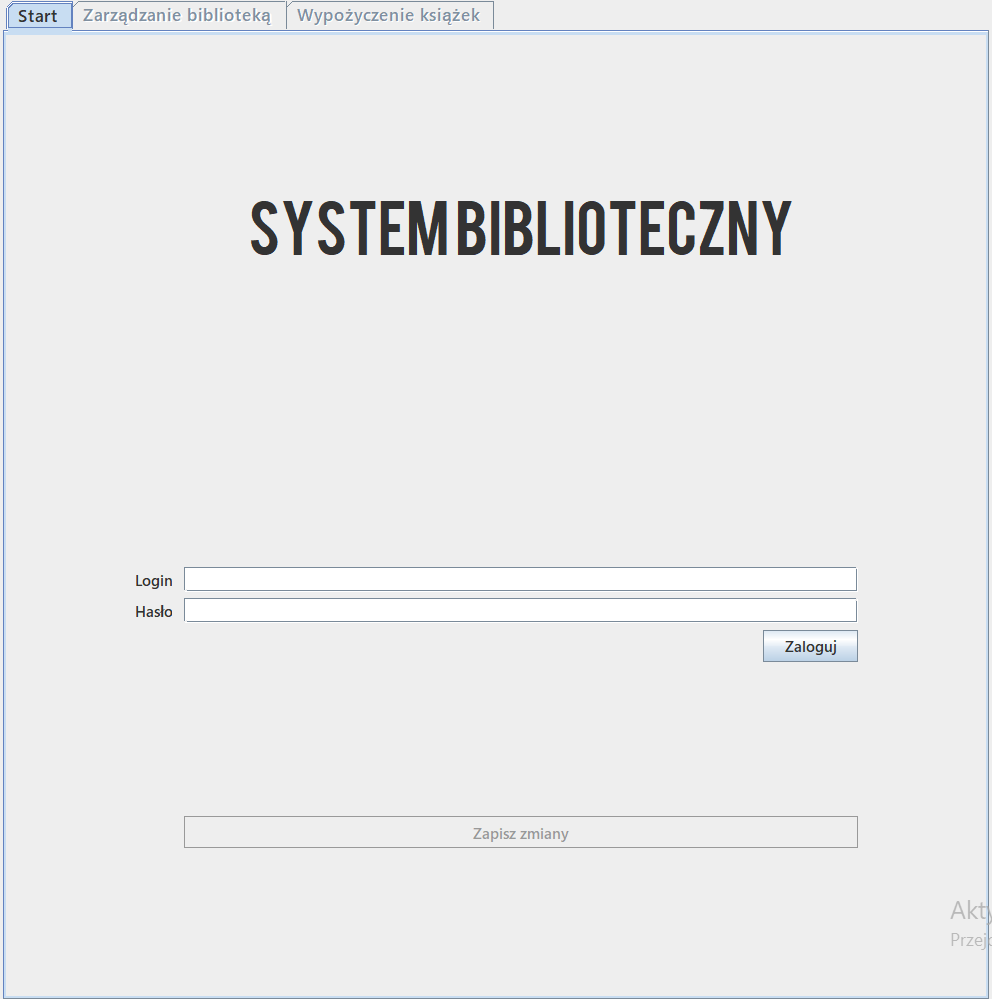
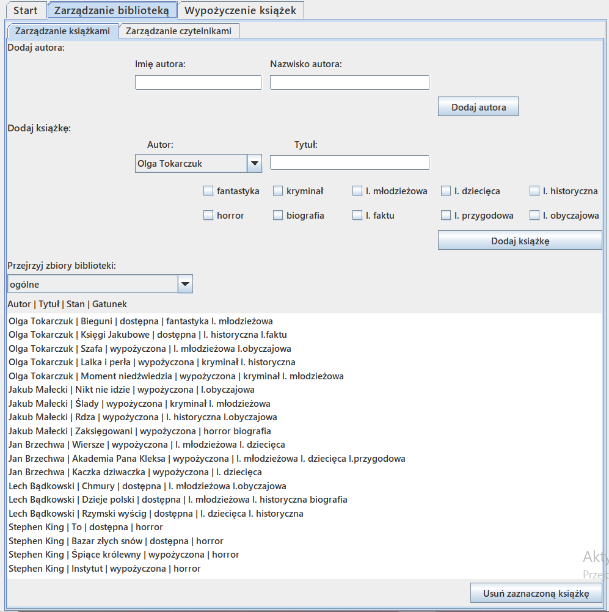
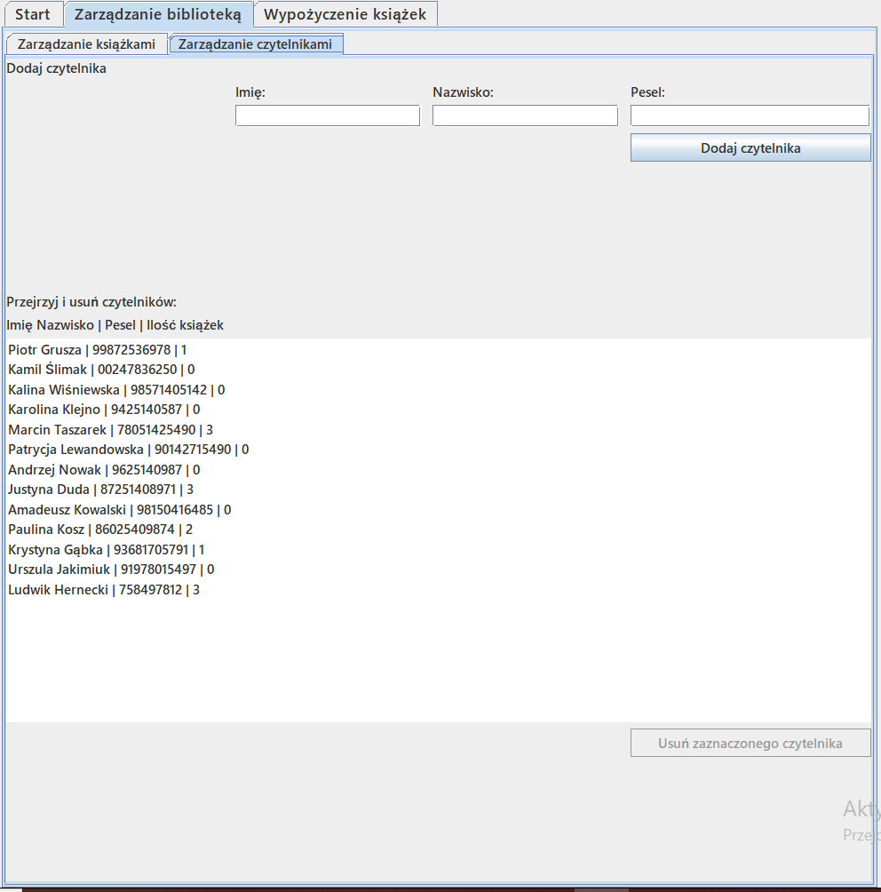
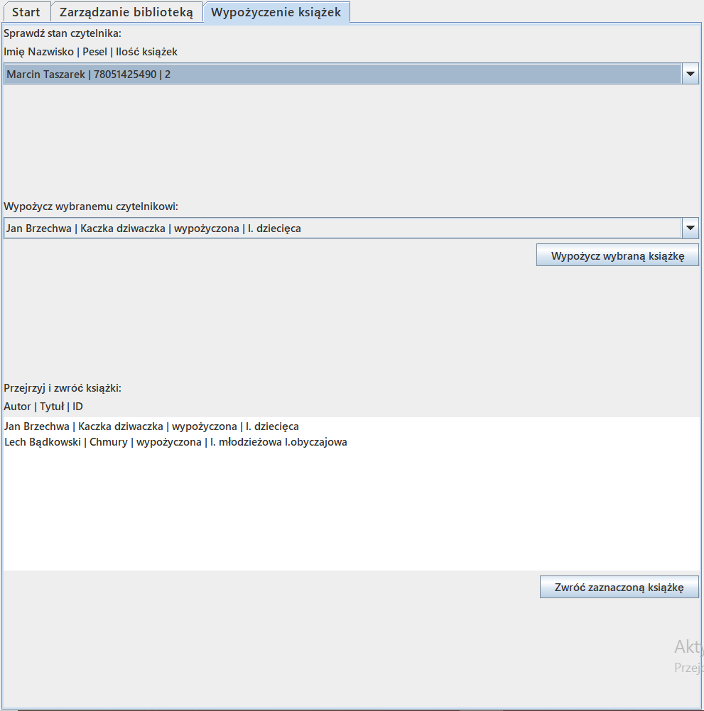

# LibrarySystem

## Table of contents
* [General info](#General-info)
* [Screenshots](#Screenshots)
* [Features](#Features)
* [Technologies](#Technologies)

## General info
This project is simple library system

## Screenshots

## Features
* User Authentication
* Adding/Removing authors
* Adding/Removing readers
* Adding/Removing books
* Borrowing/Returning book
* Viewing readers' collection
* Viewing authors' work
* Filtering books by genre

## Technologies
Project is created with:
* Java Swing
